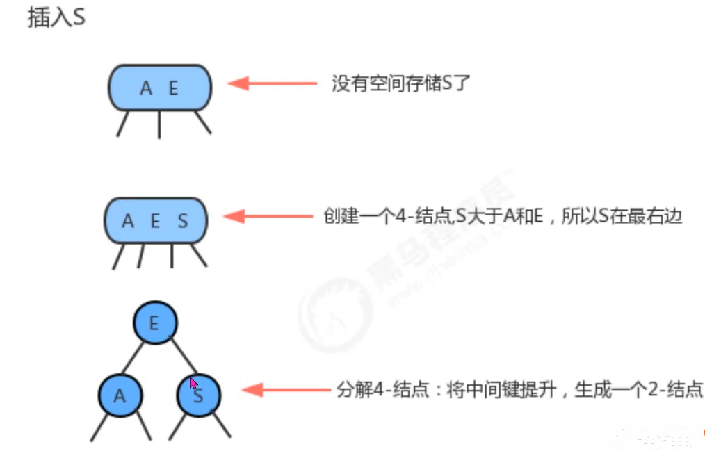

# 算法


## 时间复杂度

一次循环解决，时间复杂度:    
n
两次：                     
2n

2循环嵌套                  
n^2
3                      

二分法时间复杂度为
logn
....

## 排序方法

```java
排序方法        时间复杂度(最好)        时间复杂度(最坏)        时间复杂度(平均)
直接插入        O(n)                    O(n^2)                  O(n^2)
简单选择        O(n^2)                  O(n^2)                  O(n^2)
冒泡排序        O(n)                    O(n^2)                  O(n^2)
希尔排序        O(n)                    O(1.3)                  O(n^1.3)
快速排序        O(nlogn)                O(n^2)                  O(nlogn)
堆排序          O(nlogn)                O(nlogn)                O(nlogn)
归并排序        O(nlogn)                O(nlogn)                O(nlogn)
```

## 二分法查找

前提：数组必须有序

for循环可写，递归尝试

```java
package org.suanfa;

public class ErFen {
    public static void main(String[] args) {
        int[] arr = {1,3,6,10,40,55,67,84,99};
        System.out.println(getIndex(arr,arr.length-1,0,67));
    }
    public static int getIndex(int[] arr,int max,int min,int value){
        int middle = ( max + min ) / 2;
        if (max <= min && arr[middle]!=value){
            return -1;
        }else if (arr[middle] > value){
            return getIndex(arr,middle - 1, min, value);
        }else if (arr[middle] < value){
            return getIndex(arr ,max ,middle + 1, value);
        }else {
            return middle;
        }
    }
}

```

## 冒泡排序

简单使用fori循环

```java

package org.suanfa;

import java.util.Arrays;

public class MaoPao {
    public static void main(String[] args) {
        int[] arr = {7,5,6,9,3,4,9,5,1,3,6,4,8};
        sort(arr);
        System.out.println(Arrays.toString(arr));
    }
    public static void change(int[] arr,int a,int b){
        int tmp = arr[a];
        arr[a] = arr[b];
        arr[b] = tmp;
    }
    public static void sort(int[] arr){
        for (int j = 0; j < arr.length-1; j++) {
            for (int i = 0; i < arr.length-1-j; i++) {
                if(arr[i]>arr[i+1]){
                    change(arr,i,i+1);
                }
            }
        }
    }
}


```
## 选择排序

```java
package org.suanfa;

import java.util.Arrays;

public class Select {
    public static void main(String[] args) {
        int[] arr = {7,5,6,9,3,4,9,5,1,3,6,4,8};
        select(arr);
        System.out.println(Arrays.toString(arr));
    }
    public static void change(int[] arr,int a,int b){
        int tmp = arr[a];
        arr[a] = arr[b];
        arr[b] = tmp;
    }
    public static void select(int[] arr){
        for (int j = 0; j < arr.length-1; j++) {
            for (int i = j + 1; i < arr.length; i++) {
                if(arr[j]>arr[i]){
                    change(arr,j,i);
                }
            }
        }
    }
}

```

## 递归

略

注意，超过18000左右会爆栈

## 快速排序递归实现

```java
package org.suanfa;

import java.util.Arrays;

public class Pace {
    public static void main(String[] args) {
        int[] arr = {7,5,6,9,3,4,9,5,1,3,6,4,8};
        pace(arr,0,arr.length-1);
        System.out.println(Arrays.toString(arr));
    }
    public static void pace(int[] arr,int first,int end){
        if(first>=end){
            return;
        }
        int A = first;
        int B = end;
        int target = arr[first];
        while (A!=B) {
            while (arr[B] >= target&&B>A) {
                B--;
            }
            while (arr[A] <= target&&B>A) {
                A++;
            }
            change(arr,A,B);
        }
        change(arr,A,first);
        pace(arr,first,A-1);
        pace(arr,B+1,end);
    }
    public static void change(int[] arr,int a,int b){
        int tmp = arr[a];
        arr[a] = arr[b];
        arr[b] = tmp;
    }
}

```

# 数据结构

## 集合体系

Collection 单列集合顶层接口

set -- 接口 自动去重 没索引
    HashSet 类
    TreeSet 类
List -- 接口 不去重 有索引
    ArrayList 类
    LinkedList 类

Map 双列集合顶层接口
    HashMap 类
    TreeMap 类

#### Collection的共性

```java
package org.day05;

import java.text.ParseException;
import java.util.ArrayList;
import java.util.Collection;
import java.util.function.Predicate;


public class Utils {
    public static void main(String[] args) {
        /*Collection的共性
        * boolean add(E e)              添加元素
        * boolean remove(Object o)      从集合中移除指定元素
        * boolean removeIf(Predicate o) 根据条件进行删除
        * void clear()                  清空集合
        * boolean contains(Object o)    判断集合是否为空
        * int size()                    集合的长度，集合中元素的个数
        * */
        Collection<String> col = new ArrayList<>();//多态中，父类有的才可以调用
        col.add("abc");
        col.add("abc1");
        col.add("abc2");
        col.add("abc3");
        col.add("ab");
        col.add("a");
        col.remove("abc1");
        boolean bcd = col.remove("bcd");
        System.out.println(bcd);
       /* col.removeIf(new Predicate<String>() {
            @Override
            public boolean test(String s) { //s是col 集合中存储的元素
                return s.length()<4;
            }
        });*/
        //lambda表达式
        col.removeIf(s->s.length()<4);
        System.out.println(col);
        boolean abc = col.contains("abc");
        System.out.println(abc);
        col.clear();
        System.out.println(col);
        //......
    }
}

```

#### Collection 的共性 遍历 迭代器

```java
package org.day05;

import java.text.ParseException;
import java.util.ArrayList;
import java.util.Collection;
import java.util.Iterator;
import java.util.function.Predicate;


public class Utils {
    public static void main(String[] args) {

        Collection<String> col = new ArrayList<>();
        col.add("abc");
        col.add("abc1");
        col.add("abc2");
        col.add("abc3");
        col.add("abc4");
       /* for (int i = 0; i < col.size(); i++) {
            //System.out.println(col.get(i)); 报错捏 ArrayList不报错因为get是ArrayList的特有方法
            //共性遍历 "迭代器"

        }*/
        
        Iterator<String> iterator = col.iterator();
        //不用for循环
        /*
        for (int i = 0; i < col.size(); i++) {
            System.out.print(iterator.next()+" ");
        }*/
        while (iterator.hasNext()){
            System.out.println(iterator.next());
        }
    }
}

```

#### 迭代器 remove

```java
package org.day05;

import java.text.ParseException;
import java.util.ArrayList;
import java.util.Collection;
import java.util.Iterator;
import java.util.function.Predicate;


public class Utils {
    public static void main(String[] args) {
        //ArrayList的删除
        ArrayList<String> al = new ArrayList<>();
        al.add("abc");
        al.add("a");
        al.add("a");
        al.add("a");
        al.add("abc4");
        for (int i = 0; i < al.size(); i++) {
            String s = al.get(i);
            if("a".equals(s)){
                al.remove(i);
                i--;
            }
        }
        System.out.println(al);

        ArrayList<String> al2 = new ArrayList<>();
        al2.add("abc");
        al2.add("a");
        al2.add("a");
        al2.add("a");
        al2.add("abc4");
        for (int i = al2.size() - 1; i >= 0; i--) {
            String s1 = al2.get(i);
            if("a".equals(s1)){
                al2.remove(i);
            }
        }
        System.out.println(al2);

        ArrayList<String> al3 = new ArrayList<>();
        al3.add("abc");
        al3.add("a");
        al3.add("a");
        al3.add("a");
        al3.add("abc4");
        while (al3.remove("a"));//时间复杂度太高 n^2
        System.out.println(al3);
        //Collection的删除 迭代器
        Collection<String> col = new ArrayList<>();
        col.add("abc");
        col.add("a");
        col.add("a");
        col.add("a");
        col.add("abc4");
        Iterator<String> iterator = col.iterator();
        while (iterator.hasNext()){
            String next = iterator.next();
            if(next.equals("a")){
                iterator.remove();
            }
        }
        System.out.println(col);
        //removeIf
        Collection<String> col2= new ArrayList<>();
        col2.add("abc");
        col2.add("a");
        col2.add("a");
        col2.add("a");
        col2.add("abc4");
        col2.removeIf(s->s.equals("a"));
        System.out.println(col2);
    }
}

```

#### java 用 增强 for 解决了迭代器复杂的问题


```java
package org.day05;


import java.util.ArrayList;
import java.util.Collection;


public class Utils {
    public static void main(String[] args) {
        Collection<String> col = new ArrayList<>();
        col.add("abc");
        col.add("a");
        col.add("a");
        col.add("a");
        col.add("abc4");
        for (String s : col) {
            System.out.println(s);
        }

    }
}

```

增强for底层是迭代器

所以具备迭代器的东西都可以被增强for遍历

只要实现了Iterable接口的都可以被增强for遍历


## 顺序表集合 ArrayList 集合

定长自定义集合：

```java

package org.day05;


import java.util.ArrayList;
import java.util.Collection;
import java.util.Iterator;


public class Utils {
    public static void main(String[] args) {
        MyArrayList mal = new MyArrayList();
        mal.add("a");
        mal.add("a");
        mal.add("a");
        mal.add("a");
        mal.add("a");
        mal.add("a");
        mal.add("a");
        mal.add("a");
        mal.add("a");
        mal.add("a");

        for (String s : mal) {
            System.out.println(s);
        }
        /*增强for 的底层：
        Iterator<String> it = col.iterator();
        while(it.hasNext()){
            String s = it.next();
            System.out.println(s);
        }
        */
    }
}

class MyArrayList implements Iterable<String>{
    private String[] strs = new String[10];
    private int size = 0;
    public void add(String str){
        if(size>=10){
            throw new OverTenLengthException("此集合最多添加10个数据");
        }
        strs[size++] = str;
    }

    public int size(){
        return size;
    }

    public String get(int index){
        return strs[index];
    }

    @Override
    public Iterator<String> iterator() {
        //return null;
        return new Iterator<String>() {
            private int i = 0;
            @Override
            public boolean hasNext() {
                if(i>=size){
                    return false;
                }
                return true;
            }

            @Override
            public String next() {
                return strs[i++];
            }
        };
    }
}

class OverTenLengthException extends RuntimeException{
    public OverTenLengthException(){}
    public OverTenLengthException(String message){
        super(message);
    }
}

```

## 双向链表集合 LinkedList 集合

### 基本方法

```java

package org.day05;

import java.util.LinkedList;

public class Utils {
    public static void main(String[] args) {
        LinkedList<String> list = new LinkedList<String>();
        list.add("b");//同尾插
        list.add("c");
        list.add("d");
        list.addLast("e");
        list.addFirst("a");

        //删除头尾
        //list.removeFirst();
        //list.removeLast();

        //获取头尾
        System.out.println(list.getFirst());
        System.out.println( list.getLast());
        System.out.println(list);
    }
}


```

### 自定义链表

```java
package org.day05;

import java.util.Iterator;

public class Utils {
    public static void main(String[] args) {
        MyLinkedList mll = new MyLinkedList();
        mll.add("a");
        mll.add("a");
        mll.add("c");
        mll.add("a");
        mll.add("a");
        //mll.add("b");
        for (String s : mll) {
            System.out.println(s);
        }
        System.out.println(mll.getSize());
    }
}

class MyLinkedList implements Iterable<String>{

    private Node first;
    private Node last;
    private int size = 0;
    //内部节点，自己用
    private class Node{
        Node pre;
        Node next;
        String value;

        public Node(Node pre, String value, Node next){
            this.next=next;
            this.pre=pre;
            this.value=value;
        }
    }
    public void add(String value){
        size++;
        if(first==null){
            first = new Node(null,value,null);
            last = first;
        }else {
            Node n = new Node(last,value,null);
            last.next=n;
            last = n;
        }

    }
    public int getSize(){
        return size;
    }
    @Override
    public Iterator<String > iterator(){
        return new Iterator<String>() {
            private Node n = first;
            @Override
            public boolean hasNext() {
                return n != null;
            }

            @Override
            public String next() {
                String s = n.value;
                n = n.next;
                return s;
            }
        };
    }
} 
```

### LinkedList 实现了List接口，但是List实现方法有索引，链表？索引？

用计数器模拟索引

判断索引与size/2的大小来决定从前往后还是从后往前遍历


## 补充泛型

明确时机

创建对象时

调用方法

创建类型

### 好处

让程序更精确准确，把运行错误在编写时避免

提高程序的扩展性和兼容性

### 写法

```java
package org.day05;

public class Utils {
    public static void main(String[] args) {
        MyArrayList<String> ma = new MyArrayList<>();
        ma.s = "abc";
    }
}
//泛型类
class MyArrayList<QQ>{
    public QQ s;
}

```

### 泛型方法

```java
package org.day05;

public class Utils {
    public static void main(String[] args) {
        
    }
}
class Teacher{
    public <BMW> BMW teach(BMW s){
        return s;
    }
}

```

### 局限性

在泛型中，之能调用Object的方法

```java
if(s instanceof String){
    String str = (String)s;
}
```


### 问号泛型

单独问号一般不用

```java
package org.day05;


import java.util.ArrayList;

public class Utils {
    public static void main(String[] args) {
        ArrayList<?> al = new ArrayList<>();//默认Object
        //这种泛型不是用来使用的，而是遍历

    /*    for (int i = 0; i < al.size(); i++) {
            System.out.println(al.get(i));
        }*/
        ArrayList<Integer> a = new ArrayList<>();
        method(a);
    }
    public static void method(ArrayList<?> al){
        //不涉及使用的方法
    }
}


```

一般设计中使用限定问号

```java
  public static void method(ArrayList<? extends Object> al){
        //可以限定上限
    }
```
```java
    public static void method(ArrayList<? super ArrayList> al){
        //限定下限
    }
```

## HashSet集合

### 不允许存重复元素

```java
package org.day05;


import java.util.HashSet;
import java.util.Iterator;

public class Utils {
    public static void main(String[] args) {
        HashSet<String> hs = new HashSet<>();
        hs.add("hello");
        hs.add("hjfsd");
        hs.add("uisdh");
        hs.add("hello");
        Iterator<String> iterator = hs.iterator();
        while (iterator.hasNext()){
            String str = iterator.next();
            System.out.println(str);
        }
    }

}


```

只会存入一个hello

由于实现了迭代器，所以可以使用增强for

```java
package org.day05;

import java.util.HashSet;
import java.util.Iterator;

public class Utils {
    public static void main(String[] args) {
        HashSet<String> hs = new HashSet<>();
        hs.add("hello");
        hs.add("hjfsd");
        hs.add("uisdh");
        hs.add("hello");
        for (String str : hs) {
            System.out.println(str);
        }
    }

}

```

### 自定义类不会去重

```java
package org.day05;

import java.util.HashSet;

public class Utils {
    public static void main(String[] args) {

        HashSet<Student> hs = new HashSet<>();
        Student stu0 = new Student("张三",13);
        Student stu1 = new Student("张三",13);
        Student stu2 = new Student("张三",13);
        Student stu3 = new Student("张三",13);
        Student stu4 = new Student("张三",13);
        hs.add(stu0);
        hs.add(stu1);
        hs.add(stu2);
        hs.add(stu3);
        hs.add(stu4);
        for (Student h : hs) {
            System.out.println(h);
        }
    }

}


```

全部打印

### 让电脑认为一个对象中的所有属性相同是同一个元素

#### hashCode()方法

Object的方法

```java
package org.day05;

public class Utils {
    public static void main(String[] args) {
        Student stu = new Student("张三",13);
        System.out.println(stu);
        int i = stu.hashCode();
        System.out.println(i);
        System.out.println(Integer.toHexString(i));
    }

}

```

hash = 地址 ？

不全对

Java无法获取对象的真实物理地址

所以hash值是模拟的地址值

hashCode可以重写 

```java
package org.day05;

import javax.xml.namespace.QName;

public class Student {
    private String name;
    private int age;
    Student(String name,int age){
        this.name=name;
        this.age=age;
    }

    @Override
    public int hashCode() {
        return 0;
    }
    /*  @Override
    public String toString() {
        return "Student{" +
                "name='" + name + '\'' +
                ", age=" + age +
                '}';
    }*/
}

```

hash 散列

#### 要求HashSet认为一个对象中所有属性相同即为同一个对象

HashSet 初始长度为16，每次扩容2倍

当链表数达到数组长度*加载因子的大小后就扩容

加载因子默认0.75

HashSet(int initialCapacity,float loadfactor)
默认长度，加载因子

##### hash碰撞

当散列到同一数组下时

新对象和之前存过的数据调用equals方法（比地址//没重写）

地址不同便挂载

*因此属性即使相同也无法去重*

##### equals重写

由于hash碰撞和散列的存在，即使equals重写了也无法去重所有数据

##### 重写hashCode方法

将返回值固定，所有数据都会发生hash碰撞

再重写equals就能去重

```java
package org.day05;
import java.util.Objects;

public class Student {
    private String name;
    private int age;
    Student(String name,int age){
        this.name=name;
        this.age=age;
    }

    @Override
    public int hashCode() {
        return 0;
    }

    @Override
    public boolean equals(Object o) {
        if (this == o) return true;
        if (o == null || getClass() != o.getClass()) return false;
        Student student = (Student) o;
        return age == student.age && Objects.equals(name, student.name);
    }
}

```

```java
package org.day05;

import java.util.HashSet;

public class Utils {
    public static void main(String[] args) {
        HashSet<Student> hs = new HashSet<>();
        Student stu1 = new Student("张三",13);
        Student stu2 = new Student("张三",13);
        Student stu3 = new Student("张三",13);
        Student stu4 = new Student("张三",13);
        Student stu5 = new Student("张三",13);
        System.out.println(stu1.equals(stu2));
        hs.add(stu1);
        hs.add(stu2);
        hs.add(stu3);
        hs.add(stu4);
        hs.add(stu5);
        System.out.println(hs.size());
        for (Student h : hs) {
            System.out.println(h);
        }

    }

}


```

##### 然而这样去重损失了散列的好处，不好！！

违背了hash表的初衷，十分失败

hashCode写0的原因是为了让属性相同的元素产生哈希碰撞

所以让属性不同的元素尽量不要哈希碰撞

所以让属性不同的元素哈希值不同，相同的尽量相同

```java
    @Override
    public int hashCode() {
        return 5 * age + name.hashCode();
    }
```

##### idea 自己生成的

alt+Insert自动生成

### hash表比单链表的优势

1亿个元素，单链表将遍历困难，即使是双向链表

也无法大幅提升速度

顺序表需要提前知道索引

所以效率非常低

Hash:

先调用hashCode()找到索引

再遍历链表，效率大增

#### 细节

链表单向

链表长度不一定相同

当链表过长，jdk8会将链表重新构建成二叉查找树

### #存储不按顺序怎么办

HashSet的子类

LinkedHashSet类

底层除了hash表，还有一个来年表存储顺序

## TreeSet集合

### 基本用法

```java
package org.day05;


import java.util.TreeSet;

public class Utils {
    public static void main(String[] args) {
        TreeSet<Integer> ts = new TreeSet<>();
        ts.add(10);
        ts.add(12);
        ts.add(24);
        for (Integer t : ts) {
            System.out.println(t);
        }
    }

}
```

### 不可比较时？

实现Comparable接口

```java
package org.day05;

import java.util.Objects;

public class Student implements Comparable<Student> {
    private String name;
    private int age;
    Student(String name,int age){
        this.name=name;
        this.age=age;
    }

    @Override
    public int hashCode() {
        return 5 * age + name.hashCode();
    }


    @Override
    public boolean equals(Object o) {
        if (this == o) return true;
        if (o == null || getClass() != o.getClass()) return false;
        Student student = (Student) o;
        return age == student.age && Objects.equals(name, student.name);
    }

    @Override
    public String toString() {
        return "Student{" +
                "name='" + name + '\'' +
                ", age=" + age +
                '}';
    }


    @Override
    public int compareTo(Student o) {
        //return 0;代表重复
        //return +;代表当前添加的数大，往右添加
        //return -;代表添加的数小，往左添加
        //this表示当时添加的元素
        //o代表添加过的
        //年龄从小到大，名字长度从长到短
        int num = this.age - o.age;
        num = num==0? this.name.compareTo(o.name):num;
        return num;
    }
}

```

```java
package org.day05;


import java.util.TreeSet;

public class Utils {
    public static void main(String[] args) {
        TreeSet<Student> ts = new TreeSet<>();
        Student stu0 = new Student("张三",3);
        Student stu1 = new Student("李四",4);

        ts.add(stu0);
        ts.add(stu1);
        for (Student t : ts) {
            System.out.println(t);
        }
    }
}
```
### 比较器可以改核心类库的比较规则

```java
package org.day05;


import java.util.Comparator;
import java.util.TreeSet;

public class Utils {
    public static void main(String[] args) {
        TreeSet<Integer> ts = new TreeSet<>(
                new Comparator<Integer>() {
                    @Override
                    public int compare(Integer o1, Integer o2) {
                        //o1当前,o2之前
                        return o2-o1;
                    }
                }
        );
        ts.add(12);
        ts.add(11);
        for (Integer t : ts) {
            System.out.println(t);
        }
    }
}
```

lambda优化

```java
package org.day05;
import java.util.TreeSet;

public class Utils {
    public static void main(String[] args) {
        TreeSet<Integer> ts = new TreeSet<>(
                (Integer o1,Integer o2)-> o2-o1
        );
        ts.add(12);
        ts.add(11);
        for (Integer t : ts) {
            System.out.println(t);
        }
    }
}
```

## 平衡二叉树

避免9，8，7，6，5，4，3，2，1这种添加顺序产生的链表情况

### 2-3树

TreeSet底层是红黑树，红黑树基于2-3树


节点可以存两个数据，共有三个叉



数据上升变成二叉树


### 红黑树

一种二叉树


红链接只能为左链接

没有任何节点链接两个红链接

#### 左旋


这样怎么办？


依旧左旋


#### 右旋


颜色反转

 

## 双列集合

顶层接口是Map
HashMap
TreeMap

一左一右，key,value

规定键不能重复，值没有要求

键充当索引的作用

## Map共性

### 基础操作

```java
package org.day05;
import java.util.HashMap;
import java.util.Map;
import java.util.TreeSet;

public class Utils {
    public static void main(String[] args) {
        Map<Integer,String> map = new HashMap<>();
        map.put(1,"张三");
        map.put(2,"李四");
        map.put(3,"王五");
        map.put(4,"赵六");
        map.put(3,"王八");//王八替换王五
        System.out.println(map);
        String remove = map.remove(3);//传key
        System.out.println(map);
        System.out.println(remove);
        System.out.println(map.isEmpty());
        System.out.println(map.containsKey(5));
        System.out.println(map.containsValue("张三"));
        System.out.println(map.size());
        map.clear();
    }
}
```

### 遍历

双列变单列

```java
package org.day05;
import java.util.*;

public class Utils {
    public static void main(String[] args) {
        Map<Integer,String> map = new HashMap<>();
        map.put(1,"张三");
        map.put(2,"李四");
        map.put(3,"王五");
        map.put(4,"赵六");
        Set<Integer> keySet = map.keySet();
        for (Integer i : keySet) {
            System.out.println(i);
        }
        Collection<String> values = map.values();
        for (String value : values) {
            System.out.println(value);
        }
    }
}
```

不能体现双列的优点（键值一一对应）

get()方法

```java
package org.day05;
import java.util.*;

public class Utils {
    public static void main(String[] args) {
        Map<Integer,String> map = new HashMap<>();
        map.put(1,"张三");
        map.put(2,"李四");
        map.put(3,"王五");
        map.put(4,"赵六");
        Set<Integer> integers = map.keySet();
        for (Integer integer : integers) {
            String value = map.get(integer);
            System.out.println(integer+"-"+value);
        }
    }
}
```

效率太低,n^2

entry

```java
package org.day05;
import java.util.*;

public class Utils {
    public static void main(String[] args) {
        Map<Integer,String> map = new HashMap<>();
        map.put(1,"张三");
        map.put(2,"李四");
        map.put(3,"王五");
        map.put(4,"赵六");
        Set<Map.Entry<Integer, String>> entries = map.entrySet();
        for (Map.Entry<Integer, String> entry : entries) {
            System.out.println(entry.getKey()+"-"+entry.getValue());           
        }
    }
}
```


